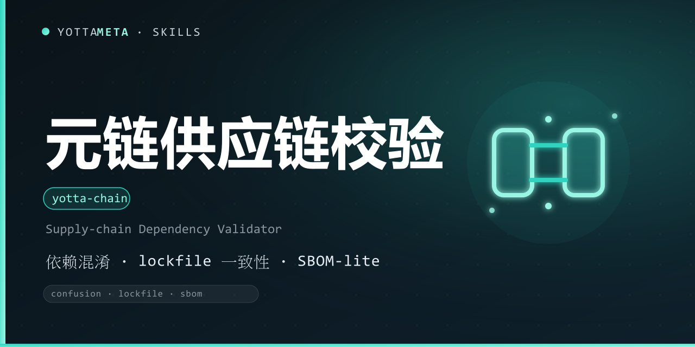

<p align="center"><b>Language</b>: <a href="./README.md">English</a> · 中文</p>

<p align="center">
  
</p>

<h1 align="center">yotta-chain · 元链 (Yuanlian)</h1>

<p align="center">YottaMeta 的零依赖供应链依赖校验引擎：本地解析 npm / Python / Maven 的依赖清单与锁文件，检测<b>依赖混淆、lockfile 不一致、缺失锁文件、未固定版本、typo-squat</b>，并生成 <b>SBOM-lite（CycloneDX 1.5 子集）</b>。</p>
<p align="center">触发场景：构建 / 发布 / CI 前检查项目依赖是否存在供应链风险、核对锁文件与清单是否一致、排查依赖混淆暴露面、生成 SBOM。</p>
<p align="center">纯 Python 3.8+ 标准库实现，零外部依赖，Windows + Linux + macOS 通用；纯本地离线——不做在线 CVE 比对、不查询公共包仓库、不发送任何数据。</p>

<p align="center">
  <a href="LICENSE"></a>
  <a href="https://agentskills.io/"></a>
  <a href="https://www.npmjs.com/package/@yottameta/yotta-chain"></a>
  <a href="https://github.com/YottaMeta/yotta-chain"></a>
  <a href="https://github.com/YottaMeta/yotta-chain/commits/main"></a>
  <a href="https://github.com/YottaMeta/yotta-chain"></a>
</p>

## 这是什么

供应链攻击瞄准的是开发者默认信任的部分：依赖混淆（私有包名被攻击者在公共仓库同名抢占）、typo-squat 仿冒包、过期或被手工改动的锁文件、缺失完整性哈希。元链把「供应链排查」打包成零依赖引擎，**本地**读取你的清单与锁文件——不需要 Trivy / Snyk / npm audit。

它与任何平台无关，是智能体无关的工具包，支持 Agent Skills 的智能体都能调用。**纯本地离线**——不做在线 CVE 比对、不查询包仓库、不发送任何数据。

## 核心价值

- **零依赖引擎**——npm semver + PEP 440 版本范围判定、TOML / JSON / requirements 解析器，全部用 Python 3.8+ 标准库实现。
- **依赖混淆**——.npmrc 里配置了私有仓库的 scope 却从公共仓库解析；同一包被多个仓库解析；可疑仓库地址（http / IP 字面量 / 本机）；pip extra-index 与 poetry secondary 源造成的公共回退。
- **lockfile 一致性**——清单条目在锁文件缺失、锁定版本超出声明范围、根 name / version 不一致、悬空引用、缺 integrity、同版本多来源冲突。
- **卫生**——缺失锁文件、未固定版本（`*` / `latest` / 无约束）、Maven SNAPSHOT 依赖。
- **typo-squat**——依赖名与知名 npm / PyPI 包编辑距离 ≤ 2 时提示人工复核。
- **SBOM-lite**——CycloneDX 1.5 子集 JSON（components + dependencies + purl，scope / direct / resolved / integrity 作为属性）。
- **三种输出**——text / JSON / CSV，外加 `--gate` 退出码闸门供 CI 使用。

## 为什么用它

| 优势 | 说明 |
|---|---|
| **零依赖** | Python 3.8+ 标准库；无常驻服务 / 数据库 / 外部扫描器；Windows + Linux + macOS |
| **纯本地离线** | 只解析已存在的清单 / 锁文件；不做在线 CVE 比对、不查询仓库、不发送任何数据 |
| **确定性信号** | 仓库配置 vs 实际解析来源、版本范围数学（npm semver / PEP 440）、完整性存在性——不是随机 URL 清单 |
| **CI 友好** | `scan --gate high` 只在达到指定严重度时退出 1 |
| **教学层** | 每条规则都带中文直白解释与修复提示 |

## 命令

| 命令 | 用途 |
|---|---|
| `scan` | 校验项目目录（自动识别 npm / python / maven） |
| `sbom` | 生成 SBOM-lite（CycloneDX 1.5 子集 JSON 或文本） |
| `version` | 显示版本 |

`scan` 退出码：**0** = 未发现达到 `--gate` 级别的风险；**1** = 有发现；**4** = 用法 / 路径 / 无受支持清单错误。默认 `--gate=info`（任何发现即退出 1）；CI 可用 `--gate high` 收紧。

## 快速使用

Windows 用 python，Linux/macOS 用 python3。

```bash
# 扫描当前项目（自动识别 npm / python / maven）
python3 scripts/yotta_chain.py scan --path ./

# 只看 medium 及以上，JSON 输出
python3 scripts/yotta_chain.py scan --path ./src --level medium --format json

# CI 闸门：达到 high 才退出码 1
python3 scripts/yotta_chain.py scan --path . --gate high; echo $?

# 生成 SBOM-lite（CycloneDX 1.5 子集 JSON）
python3 scripts/yotta_chain.py sbom --path . --output sbom.json

# 文本形式查看 SBOM
python3 scripts/yotta_chain.py sbom --path . --format text

# 版本
python3 scripts/yotta_chain.py version
```

## 安装

三种方式任选其一，技能文件统一从 **npm** 获取（GitHub 无代理时较慢，npm 可配国内镜像加速）。

### 方式一：npm（推荐，一行安装）
```bash
# 国内加速（可选）：npm config set registry https://registry.npmmirror.com
npx -y @yottameta/yotta-chain -g
npx -y @yottameta/yotta-chain --dir <你的技能目录>   # 任意智能体：指定目录安装
```
> 智能体不在预置列表里？用 `--dir` 指定它的 skills 目录，或手动复制（方式三）。`--list` 可查看各智能体对应的默认目录。想手动拿文件也可 `npm pack @yottameta/yotta-chain` 解包后按方式二/三安装。

### 方式二：install.sh 一键安装
获取技能文件夹后（`npm pack` 解包或 `git clone`），进入技能文件夹：
```bash
bash install.sh -g    # 用户级；bash install.sh --list 查看全部目录
bash install.sh --agent codex   # 指定智能体（--list 可查看可用项）
bash install.sh       # 项目级：自动检测已存在的 .claude/.cursor/.codex 等 skills 目录
bash install.sh --dir /path/to/skills
```
> 覆盖 17 类智能体，含国内 Trae / Qwen / Comate / CodeBuddy / Kimi。Windows 用户：装有 Git Bash 即可用；否则用方式三手动复制。

### 方式三：手动复制
把整个 `yotta-chain` 文件夹复制到目标智能体的 skills 目录。常见位置（用户级；Windows 用 `%USERPROFILE%`，Linux/macOS 用 `~`）：

| 智能体 | 用户级目录 | 项目级目录 |
|---|---|---|
| Codex | `%USERPROFILE%\.codex\skills\yotta-chain\` | `.codex\skills\` |
| Claude Code | `%USERPROFILE%\.claude\skills\yotta-chain\` | `.claude\skills\` |
| Cursor | `%USERPROFILE%\.cursor\skills\yotta-chain\` | `.cursor\skills\` |
| Windsurf | `%USERPROFILE%\.codeium\windsurf\skills\yotta-chain\` | `.windsurf\skills\` |
| opencode | `%USERPROFILE%\.config\opencode\skills\yotta-chain\` | `.opencode\skills\` |
| Gemini | `%USERPROFILE%\.gemini\skills\yotta-chain\` | `.gemini\skills\` |
| Goose | `%USERPROFILE%\.config\goose\skills\yotta-chain\` | `.goose\skills\` |
| Amp | `%USERPROFILE%\.config\agents\skills\yotta-chain\` | `.agents\skills\` |
| Kiro | `%USERPROFILE%\.kiro\skills\yotta-chain\` | `.kiro\skills\` |
| WorkBuddy | `%USERPROFILE%\.workbuddy\skills\yotta-chain\` | `.workbuddy\skills\` |
| Trae Code CLI | `%USERPROFILE%\.traecli\skills\yotta-chain\` | `.traecli\skills\` |
| Trae IDE（国内） | `%USERPROFILE%\.trae-cn\skills\yotta-chain\` | `.trae\skills\` |
| Qwen Code | `%USERPROFILE%\.qwen\skills\yotta-chain\` | `.qwen\skills\` |
| Comate | `%USERPROFILE%\.comate\skills\yotta-chain\` | `.comate\skills\` |
| CodeBuddy | `%USERPROFILE%\.codebuddy\skills\yotta-chain\` | `.codebuddy\skills\` |
| Kimi | `%USERPROFILE%\.kimi\skills\yotta-chain\` | `.kimi\skills\` |
| 通用 AGENTS.md | `%USERPROFILE%\.agents\skills\yotta-chain\` | `.agents\skills\` |

> 若设置了 Codex 的 `CODEX_HOME`，安装自动以该变量为准；opencode 同理（`XDG_CONFIG_HOME`）。`.agents\skills` 不是通用目录——仅 OpenCode / Cursor / Cline / Amp / Kimi / Gemini CLI / GitHub Copilot 等读取；**Claude Code 与 Codex 默认不读**。不确定时用 `--dir` 或让智能体自行安装。

> 装到项目：在项目内运行 `npx -y @yottameta/yotta-chain` 或 `bash install.sh`，会装到检测到的项目级目录。


## 让智能体使用

给智能体下指令即可，例如：

```text
发布前用 yotta-chain scan --gate high 扫一遍仓库，按严重度汇总发现并给出修复建议。
```

智能体会运行引擎、按严重度汇报发现，并用 `references/rules.md` 里的中文说明逐条解释。

## 检测规则

| 规则 | 严重度 | 说明 |
|---|---|---|
| `confusion_scope_registry` | high | .npmrc 为某 scope 配置私有仓库，锁文件却从公共仓库解析（依赖混淆） |
| `confusion_mixed_registry` | high | 同一包被解析自多个不同仓库主机 |
| `lockfile_missing_entry` | high | 清单声明的依赖在锁文件中缺失 |
| `lockfile_range_unsatisfied` | high | 锁定版本不满足声明范围（npm semver / PEP 440） |
| `lockfile_dangling_ref` | high | 锁文件某包依赖的包不在锁文件包列表 |
| `lockfile_duplicate_conflict` | high | 同名同版本存在多个不同 resolved / integrity 来源 |
| `missing_lockfile` | medium | 声明了依赖但没有锁文件 |
| `lockfile_root_mismatch` | medium | 锁文件根 name / version 与清单不一致 |
| `lockfile_integrity_missing` | medium | 锁文件条目缺少 integrity / 哈希 |
| `confusion_extra_index` | medium | pip / poetry / pipenv 同时配置公共仓库与私有源（公共成为回退源） |
| `confusion_suspicious_registry` | medium | 仓库 / 索引地址是 http、IP 字面量或本机地址 |
| `confusion_registry_mismatch` | medium | 配置了私有默认仓库，包却从公共仓库解析 |
| `unpinned` | low / medium | 依赖未固定版本（`*` / `latest` / 无约束） |
| `typosquat` | low | 名字与知名包编辑距离 ≤ 2，疑似拼写仿冒 |
| `snapshot` | low | Maven 依赖使用 SNAPSHOT 版本 |

## 支持的生态（v0.1.1）

- **npm** — `package.json` + `package-lock.json`（v1 / v2 / v3）/ `npm-shrinkwrap.json` + `.npmrc`（作用域仓库映射）；
- **Python** — `requirements*.txt`（含 `--index-url` / `--extra-index-url` / `-r` 递归）、`pyproject.toml`（PEP 621 / poetry）、`poetry.lock`、`Pipfile` / `Pipfile.lock`；
- **Maven** — `pom.xml`（基础：未固定版本 / SNAPSHOT / 可疑仓库 URL / 属性与 dependencyManagement 解析）。
- `yarn.lock` / `pnpm-lock.yaml` / `go.mod` / `Cargo.lock` v0.1.1 暂不支持（见 CHANGELOG）。

## 边界

- 只读本地文件；不联网、不做在线 CVE 比对、不查询包仓库、不发送任何数据。
- 不做在线 CVE 比对——那是 Trivy / Snyk / npm audit 的地盘；本引擎提供本地确定性解析与启发式信号。
- 依赖混淆检测是**本地近似**：真正确认「私有包名被公共仓库抢占」需要在线核对，引擎给出强信号供人工复核。
- 只读不写：绝不改锁文件、不升级依赖。

## 开发与校验

```bash
python3 -m py_compile scripts/yotta_chain.py
python3 scripts/test_yotta_chain.py   # 52/52
```

## Changelog

版本历史见 [CHANGELOG.md](./CHANGELOG.md)。

## License

[MIT](./LICENSE)